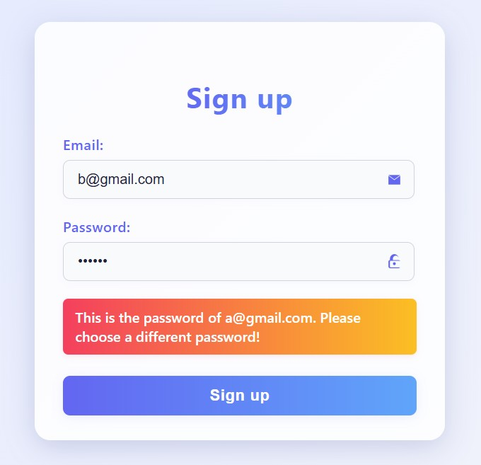

# 😠 Weird Register

Welcome to **Weird Register** – the only registration form that cares so much about your password, it won't let you use the same one as anyone else! *(Yes, even if you're just trying to be funny.)*


## What is this?
A playful web app where you can:
- Register with your email and a password (but your password must be unique across all users!)
- Get sassy error messages if you try to reuse a password
- Enjoy a modern, beautiful UI that's friendlier than your average login page

## Features
- **FastAPI** backend (Python) for handling registration and login
- **SQLite** database for storing users (and their oh-so-unique passwords)
- **SQLAlchemy** ORM for database magic
- **Passlib** for password hashing (we don't store your password in plain text, we're not monsters)
- **Vanilla JS** frontend with a stylish registration form

## How to Run This Weird Thing

### 1. Backend (API)
1. Go to the `server/` directory:
   ```sh
   cd server
   ```
2. Install dependencies (Python 3.10+ recommended):
   ```sh
   pip install -r requirements.txt
   ```

3. Start the FastAPI server:
   ```sh
   uvicorn app:app
   ```

### 2. Frontend (HTML/JS)
Just open `index.html` in your browser. That's it. No build tools, no nonsense.

## How Does It Work?
- Enter your email and a password **(at least 6 characters!)**
- If your email is already used, you'll get a warning
- If your password is already used by someone else, you'll get a *very* specific warning
- If all is well, you're registered! 🎉

## Example


## Why?
Because normal registration forms are boring. And because you should never reuse passwords (seriously).

## Credits
- Inspired by every website that ever told you *"this password is too common."*
- Made with ❤️ by a developer who laughs at their own error messages everyday 24/7.
